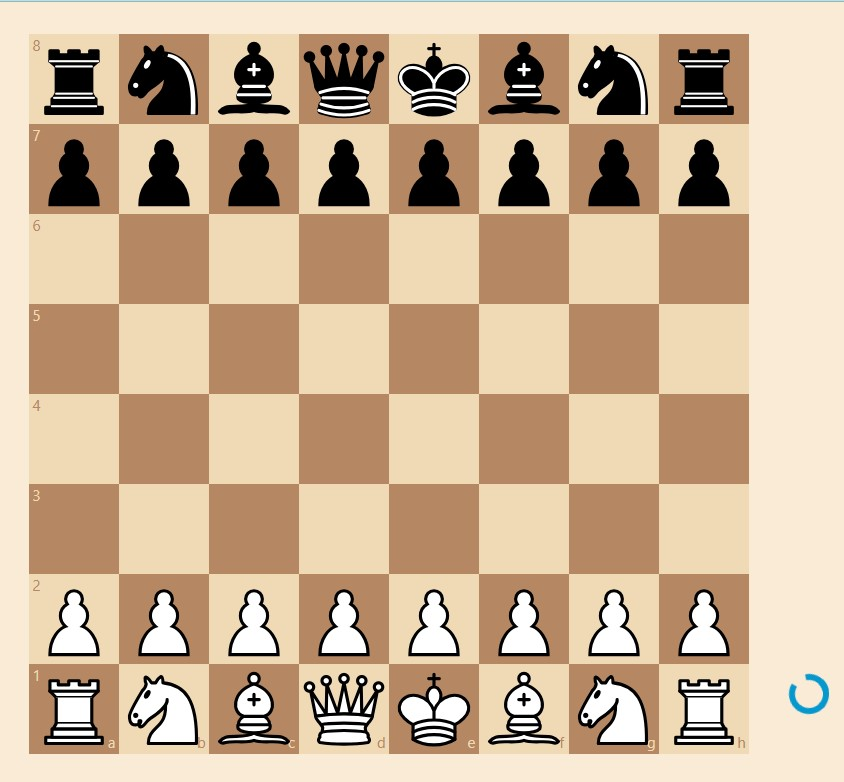
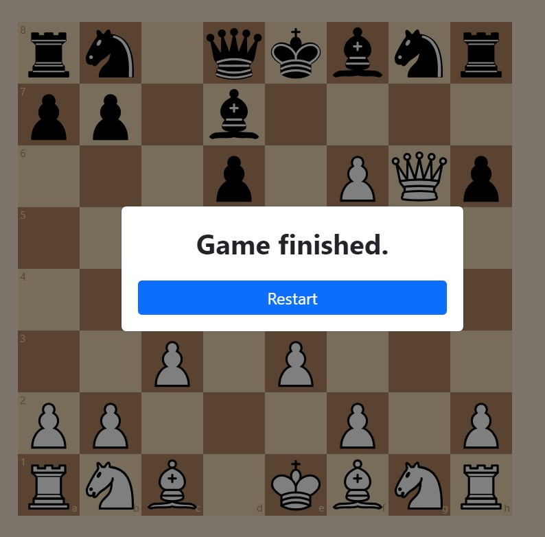

<a name="readme-top"></a>

<!-- PROJECT LOGO -->
<br />
<div align="center">
  <h1 align="center">Chess App</h1>
  <p align="center">
    A React, BootStrap and TypeScript application that allows users to play chess.
  </p>
</div>

<!-- TABLE OF CONTENTS -->
<details>
  <summary>Table of Contents</summary>
  <ol>
    <li>
      <a href="#about-the-project">About The Project</a>
      <ul>
        <li><a href="#built-with">Built With</a></li>
      </ul>
    </li>
    <li>
      <a href="#getting-started">Getting Started</a>
      <ul>
        <li><a href="#installation">Installation</a></li>
      </ul>
    </li>
    <li><a href="#usage">Usage</a></li>
    <li><a href="#roadmap">Roadmap</a></li>
    <li><a href="#contact">Contact</a></li>
  </ol>
</details>

<!-- ABOUT THE PROJECT -->

## About The Project

<p align="center">
   
   
</p>

This application allows users to play chess.

<p align="right">(<a href="#readme-top">back to top</a>)</p>

### Built With

- ![React][React.js]
- ![TypeScript][TypeScript]
- ![Bootstrap][Bootstrap]
- ![Jest][Jest]
- ![Cypress][Cypress]
- ![Eslint][Eslint]
- ![Prettier][Prettier]
- <b>chess</b>
- <b>react-chessboard</b>

<p align="right">(<a href="#readme-top">back to top</a>)</p>

<!-- GETTING STARTED -->

## Getting Started

### Installation

1. Install NPM packages
   ```sh
   yarn
   ```
2. Build the website
   ```sh
   yarn build
   ```
3. Test the website
   ```sh
   yarn test
   ```
4. Start the website
   ```sh
   yarn start
   ```

<p align="right">(<a href="#readme-top">back to top</a>)</p>

<!-- USAGE EXAMPLES -->

## Usage

Utilized `chess` and `chessboard` npm modules to build a react project that the user can interact with valid chess-logic on the GUI board.
<br/>
Built responsive designs with `React` and `Bootstrap`.
Save application states using `React Context API`.
<br/>
Implemented some simple `unit`, `integration`, and `e2e` testings by `Jest` and `Cypress`. Mocked `Context API` to test the pages and components.
<br/>

<p align="right">(<a href="#readme-top">back to top</a>)</p>

<!-- ROADMAP -->

## Roadmap

- [x] Use `react-chessboard` for generating visual chessboard
- [x] Use `chess.js` for checking chess logic
- [x] Use `BootStrap` to build UI components
- [x] Implement unit, integration and e2e testing by `Jest` and `Cypress`

<p align="right">(<a href="#readme-top">back to top</a>)</p>

<!-- CONTACT -->

## Contact

Momin Mokthar - toptalent0301@gmail.com

<p align="right">(<a href="#readme-top">back to top</a>)</p>

<!-- MARKDOWN LINKS & IMAGES -->
<!-- https://www.markdownguide.org/basic-syntax/#reference-style-links -->

[React.js]: https://img.shields.io/badge/React-20232A?style=for-the-badge&logo=react&logoColor=61DAFB
[TypeScript]: https://img.shields.io/badge/TypeScript-007ACC?style=for-the-badge&logo=typescript&logoColor=white
[Bootstrap]: https://img.shields.io/badge/Bootstrap-7952B3?logo=bootstrap&logoColor=fff&style=for-the-badge
[Jest]: https://img.shields.io/badge/Jest-323330?style=for-the-badge&logo=Jest&logoColor=white
[Cypress]: https://img.shields.io/badge/Cypress-17202C?style=for-the-badge&logo=cypress&logoColor=white
[Eslint]: https://img.shields.io/badge/ESLint-4B32C3?logo=eslint&logoColor=fff&style=for-the-badge
[Prettier]: https://img.shields.io/badge/Prettier-F7B93E?logo=prettier&logoColor=fff&style=for-the-badge
